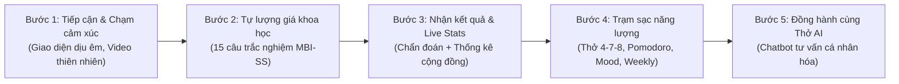

# ĐỀ ÁN CHĂM SÓC SỨC KHỎE TÂM LÝ HỌC ĐƯỜNG
# THỞ — CÙNG VƯỢT QUA BURNOUT HỌC ĐƯỜNG 🌤️

> **Tài liệu toàn diện về Luồng hoạt động, Cơ sở khoa học và Kiến trúc Trợ lý Tâm lý Thở AI**  
> *Dành cho người dùng đại chúng, học sinh, phụ huynh, giáo viên và hội đồng giám khảo chuyên môn.*

---

## MỤC LỤC
1. [Bối cảnh thực tiễn & Cơ sở khoa học](#1-bối-cảnh-thực-tiễn--cơ-sở-khoa-học)
   - 1.1. Thực trạng kiệt sức học tập ở học sinh THPT
   - 1.2. Thang đo MBI-SS (Maslach Burnout Inventory - Student Survey)
   - 1.3. Triết lý bảo mật & Tôn trọng quyền riêng tư (No-Auth)
2. [Bản đồ hành trình người dùng (User Journey) & Luồng hoạt động](#2-bản-đồ-hành-trình-người-dùng-user-journey--luồng-hoạt-động)
   - 2.1. 5 bước trải nghiệm khép kín
   - 2.2. Chi tiết các Trạm sạc năng lượng (Relief Tools)
3. [Chuyên sâu về Trợ lý Tâm lý Thở AI (Gemini Flash)](#3-chuyên-sâu-về-trợ-lý-tâm-lý-thở-ai-gemini-flash)
   - 3.1. Sứ mệnh & Định vị của Thở AI
   - 3.2. Sơ đồ Kiến trúc Kỹ thuật (System Architecture & Data Flow)
   - 3.3. Cơ chế Cá nhân hóa thông minh (Context Injection)
   - 3.4. Công nghệ truyền phát chữ thời gian thực (SSE Streaming)
   - 3.5. Bộ quy tắc ứng xử & Hàng rào bảo vệ an toàn (Safety Guardrails)
   - 3.6. Các ràng buộc hệ thống & Tối ưu tài nguyên (Constraints & Token Optimization)
4. [Thiết kế Công thái học & Trải nghiệm Người dùng (UI/UX)](#4-thiết-kế-công-thái-học--trải-nghiệm-người-dùng-uiux)
5. [Cấu trúc Dữ liệu & Bảng tổng hợp Tính năng](#5-cấu-trúc-dữ-liệu--bảng-tổng-hợp-tính-năng)
6. [Tổng kết & Khuyến cáo Y khoa (Disclaimer)](#6-tổng-kết--khuyến-cáo-y-khoa-disclaimer)

---

## 1. BỐI CẢNH THỰC TIỄN & CƠ SỞ KHOA HỌC

### 1.1. Thực trạng kiệt sức học tập ở học sinh THPT
Áp lực thi cử, khối lượng kiến thức đồ sộ cùng kỳ vọng lớn từ gia đình đang khiến nhiều học sinh THPT rơi vào trạng thái kiệt sức học tập (**Academic Burnout**). Học sinh thường trải qua cảm giác mệt mỏi triền miên, mất động lực, tự ti và thờ ơ với việc học nhưng không biết giãi bày cùng ai hoặc sợ bị phán xét.

Dự án **Thở (Tho Breathing)** ra đời như một không gian số tĩnh lặng, kết hợp hài hòa giữa **Nghiên cứu tâm lý học thực chứng** và **Trí tuệ nhân tạo hiện đại**, giúp học sinh:
- Tự nhận diện chính xác tình trạng kiệt sức của bản thân qua thang đo khoa học.
- Tiếp cận ngay các công cụ xoa dịu thần kinh tức thì.
- Lắng nghe và nhận lời khuyên thấu cảm từ trợ lý Thở AI mà không lo bị lộ danh tính.

---

### 1.2. Thang đo MBI-SS (Maslach Burnout Inventory - Student Survey)
Dự án kế thừa và chuẩn hóa bài kiểm tra 15 câu hỏi trắc nghiệm dựa trên đề tài nghiên cứu:  
*«Thực trạng và giải pháp khắc phục hội chứng kiệt sức học tập (Academic Burnout)»*.

Thang đo khảo sát 3 chiều kích tâm lý độc lập:
1. **Kiệt sức cảm xúc (Emotional Exhaustion - EX - 5 câu hỏi):** Đánh giá mức độ cạn kiệt năng lượng, mệt mỏi thể chất lẫn tinh thần do việc học dồn dập.
2. **Sự hoài nghi / Thờ ơ học tập (Cynicism - CY - 4 câu hỏi):** Đánh giá thái độ chán nản, mất hứng thú, cảm giác việc học là vô nghĩa và muốn né tránh trường lớp.
3. **Giảm sút hiệu quả học tập cá nhân (Low Professional Efficacy - PE - 6 câu hỏi):** Đánh giá cảm giác bất lực, tự ti, cảm thấy mình không đủ năng lực để hoàn thành nhiệm vụ học tập (chiều kích này được tính điểm đảo ngược).

#### Bảng Tiêu chuẩn Phân loại Burnout:
| Mức độ phân loại | Điểm số trung bình | Biểu hiện tâm lý | Đề xuất giải pháp |
|---|---|---|---|
| **Mức 1: Bình thường** | < 2.00 điểm | Tâm lý cân bằng, điều hòa tốt giữa học tập và sinh hoạt. | Tiếp tục duy trì thói quen học tập và nghỉ ngơi hợp lý. |
| **Mức 2: Nguy cơ vừa** | 2.00 – 3.49 điểm | Bắt đầu xuất hiện căng thẳng, mất tập trung, mệt mỏi rải rác. | Cần áp dụng kỹ thuật thở 4-7-8, giảm tải bài vở và chia sẻ với Thở AI. |
| **Mức 3: Kiệt sức cao** | ≥ 3.50 điểm | Cạn kiệt năng lượng, thờ ơ, mất ngủ, áp lực đè nặng kéo dài. | Cần can thiệp khẩn cấp: Nghỉ ngơi trọn vẹn, tìm sự hỗ trợ từ gia đình, giáo viên và chuyên gia tâm lý. |

---

### 1.3. Triết lý bảo mật & Tôn trọng quyền riêng tư (No-Auth)
- Học sinh **KHÔNG CẦN ĐĂNG KÝ TÀI KHOẢN** hay cung cấp email, số điện thoại, mật khẩu.
- Khi làm khảo sát, học sinh chỉ cần nhập Tên/Biệt danh và Năm sinh để hệ thống cá nhân hóa xưng hô.
- Điều này loại bỏ 100% rào cản e ngại bị lộ danh tính, giúp học sinh hoàn toàn cởi mở và trung thực khi trả lời trắc nghiệm.

---

## 2. BẢN ĐỒ HÀNH TRÌNH NGƯỜI DÙNG (USER JOURNEY) & LUỒNG HOẠT ĐỘNG

### 2.1. 5 bước trải nghiệm khép kín



1. **Bước 1: Tiếp cận & Chạm cảm xúc:** Học sinh vào trang web, được đón nhận bằng tông màu pastel thư giãn, các đốm sáng nhịp thở nhẹ nhàng (*Ambient Breathing Glow*), video thiên nhiên êm đềm và thông điệp nâng đỡ tinh thần.
2. **Bước 2: Tự lượng giá khoa học:** Trả lời 15 câu hỏi ngắn gọn theo thang điểm từ 0 (Không bao giờ) đến 6 (Mỗi ngày). Thiết kế tối ưu trên điện thoại, thao tác chỉ mất 2-3 phút.
3. **Bước 3: Xem kết quả chẩn đoán & So sánh cộng đồng:**
   - Hệ thống hiển thị mức độ kiệt sức, điểm số từng khía cạnh và lời khuyên cụ thể.
   - Bảng **Thống kê cộng đồng thời gian thực (Live Community Stats)** hiển thị tỷ lệ các bạn cùng trường/lớp đang ở các mức độ nào. Điều này tạo hiệu ứng tâm lý giải tỏa mạnh mẽ: *"Mình không hề đơn độc hay dị biệt, nhiều bạn cũng đang trải qua điều tương tự"*.
4. **Bước 4: Sử dụng Trạm sạc năng lượng (Relief Tools):** Học sinh thực hành ngay các công cụ điều hòa tâm trạng.
5. **Bước 5: Trò chuyện chuyên sâu cùng Thở AI:** Bấm nút Thở AI để trò chuyện, tháo gỡ từng nút thắt học tập.

---

### 2.2. Chi tiết các Trạm sạc năng lượng (Relief Tools)

- **Bài tập thở 4-7-8 (Harmonious Breathing):**  
  *Cơ sở khoa học:* Nghiên cứu của TS. Andrew Weil (Đại học Harvard). Hít vào bằng mũi trong 4s $\rightarrow$ Giữ hơi thở trong 7s $\rightarrow$ Thở ra từ từ bằng miệng trong 8s.  
  *Cơ chế sinh học:* Hơi thở dài kích hoạt hệ thần kinh phó giao cảm (Parasympathetic), hạ nhịp tim, giảm hormone cortisol, chặn đứng cơn hoảng loạn trước giờ kiểm tra.
- **Đồng hồ Pomodoro Thông minh (25 phút / 5 phút):**  
  Chia buổi học thành các đợt 25 phút tập trung cao độ và 5 phút giải lao. Giúp não bộ phục hồi dopamine, học tập bền bỉ mà không bị quá tải.
- **Nhật ký cảm xúc (Mood Tracker):**  
  5 biểu tượng cảm xúc (Rất tuyệt, Vui vẻ, Bình thường, Căng thẳng, Kiệt sức). Nguyên lý *"Name it to tame it"* giúp học sinh nhận diện và làm chủ cảm xúc của mình.
- **Kế hoạch Tuần Tự động Hóa (Weekly Planner):**  
  Bảng theo dõi thói quen 7 ngày (T2 - CN).  
  *Điểm sáng công nghệ:* Tự động làm mới (Auto-reset) vào mỗi sáng Thứ Hai hàng tuần: hệ thống tự động xóa các dấu tích tuần cũ nhưng giữ nguyên tên các thói quen học sinh đã đặt, giúp bắt đầu tuần mới gọn gàng và đầy cảm hứng.

---

## 3. CHUYÊN SÂU VỀ TRỢ LÝ TÂM LÝ THỞ AI (GEMINI FLASH)

### 3.1. Sứ mệnh & Định vị của Thở AI
Thở AI được định vị là **"Người bạn đồng hành tâm lý học đường"**.

| Thở AI LÀ | Thở AI KHÔNG PHẢI LÀ |
|---|---|
| Người bạn lắng nghe thấu cảm, không phán xét. | Công cụ chẩn đoán tâm thần thay bác sĩ. |
| Người hướng dẫn các bước hành động siêu nhỏ (Micro-steps). | Chatbot giải bài tập, làm văn hộ học sinh. |
| Trợ lý am hiểu tình trạng kiệt sức qua bài test MBI-SS. | Chatbot bói toán, đố vui hay trả lời lan man ngoài lề. |

---

### 3.2. Sơ đồ Kiến trúc Kỹ thuật (System Architecture & Data Flow)

```
[ Học sinh gửi tin nhắn ]
         │
         ▼
[ Giao diện React Frontend ] ── Kiểm tra độ dài (Max 500 ký tự)
         │ (HTTP POST SSE)
         ▼
[ Backend NestJS Gateway ]
         │
         ├── 🛡️ Kiểm tra Rate Limit (Chống spam: 5 tin/phút, 30 tin/ngày)
         ├── 🧠 Bơm ngữ cảnh (Context Injection từ bài test MBI-SS)
         └── 📦 Nén lịch sử trò chuyện (Giữ 6 tin gần nhất + Tóm tắt tin cũ)
         │
         ▼
[ Google Gemini 3.6 Flash Engine ]
         │ (Stream phản hồi)
         ▼
[ SSE Realtime Streamer ] ── Bắn từng chữ về màn hình học sinh ngay tức thì
         │
         ▼
[ MongoDB Atlas Database ] ── Lưu trữ bảo mật (Tự động xóa sạch sau 30 ngày)
```

---

### 3.3. Cơ chế Cá nhân hóa thông minh (Context Injection)
Khi học sinh làm xong bài khảo sát, hệ thống ghi nhớ:
- Tên gọi / Biệt danh
- Năm sinh / Độ tuổi
- Điểm số từng khía cạnh (Kiệt sức cảm xúc, Hoài nghi, Giảm hiệu quả)
- Mức độ chẩn đoán (Bình thường / Nguy cơ vừa / Kiệt sức cao)

Khi mở khung chat, AI tự động nạp ngữ cảnh này vào "não":
- Chào đúng tên học sinh, xưng hô gần gũi như một người anh/người chị khóa trên hoặc người bạn thân thiết.
- Đưa ra lời khuyên "đúng bệnh":
  - Nếu điểm **Hoài nghi** cao: AI sẽ gợi mở lại lý do học sinh bắt đầu, kết nối việc học với ước mơ cá nhân thay vì áp lực điểm số.
  - Nếu điểm **Kiệt sức** cao: AI sẽ khuyên học sinh dừng bài vở lại, hướng dẫn thở 4-7-8 và đi ngủ sớm.
  - Nếu điểm **Giảm sút hiệu quả** cao: AI chia nhỏ mục tiêu học tập thành các bước 10-15 phút để học sinh lấy lại sự tự tin.

---

### 3.4. Công nghệ truyền phát chữ thời gian thực (SSE Streaming)
- **Phương pháp cũ (Non-streaming):** Học sinh gửi tin nhắn $\rightarrow$ Hệ thống chờ AI nghĩ xong toàn bộ câu trả lời (5–8 giây) $\rightarrow$ Đột ngột hiện ra cả đoạn văn dài. Trải nghiệm này tạo cảm giác sốt ruột và máy móc.
- **Phương pháp mới (Server-Sent Events - SSE Streaming):** Ngay khi AI xử lý từ đầu tiên (chưa đầy 0.5s), các từ ngữ sẽ lần lượt tuôn chảy trên màn hình mượt mà như có một người bạn đang ngồi gõ phím trực tiếp. Điều này tạo cảm giác kết nối ấm áp, tự nhiên và thư thái.

---

### 3.5. Bộ quy tắc ứng xử & Hàng rào bảo vệ an toàn (Safety Guardrails)
Hệ thống được thiết lập bộ chỉ dẫn đạo đức nghiêm ngặt (System Instructions):
1. **Không chẩn đoán y khoa:** Khi phát hiện học sinh có dấu hiệu rối loạn tâm thần nặng hoặc suy nghĩ tiêu cực cực đoan (tự hại), Thở AI lập tức ngừng khuyên nhủ chủ quan, hiển thị thông điệp khẩn cấp và cung cấp số điện thoại đường dây nóng bảo vệ trẻ em và tư vấn tâm lý (Tổng đài 111 hoặc 1900 6233).
2. **Không làm hộ bài tập:** Từ chối lịch sự mọi yêu cầu giải toán, viết văn hộ.
3. **Không khuyên sáo rỗng:** Tuyệt đối không dùng những câu vô thưởng vô phạt như *"Cố gắng lên"* hay *"Đừng buồn nữa"*. Thay vào đó, AI hướng dẫn các hành động siêu nhỏ: *"Bây giờ bạn hãy uống một ngụm nước ấm", "Hãy duỗi thẳng hai tay ra sau lưng trong 30 giây"*.
4. **Giới hạn phạm vi học đường:** Từ chối các chủ đề độc hại, chính trị, cờ bạc.

---

### 3.6. Các ràng buộc hệ thống & Tối ưu tài nguyên (Constraints & Token Optimization)

| Ràng buộc (Constraint) | Thông số kỹ thuật | Lý do thiết kế (Dễ hiểu) |
|---|---|---|
| **Giới hạn tin nhắn theo ngày (Daily Cap)** | Tối đa **30 tin / ngày / người** | Tránh việc học sinh bị "nghiện chat" với AI thâu đêm thay vì đi ngủ nghỉ ngơi thật sự; đồng thời kiểm soát chi phí token. |
| **Giới hạn tốc độ gửi (Rate Limit)** | Tối đa **5 tin / phút** | Ngăn chặn kẻ xấu dùng phần mềm tự động bắn tin liên tục làm treo hệ thống. |
| **Giới hạn độ dài tin nhắn (Input Limit)** | Tối đa **500 ký tự / tin** | Hướng học sinh đúc kết cảm xúc súc tích, tránh việc dán nguyên một bài văn dài làm tràn bộ nhớ AI. |
| **Giới hạn độ dài câu trả lời (Output Limit)** | Tối đa **512 token (~300 từ)** | Giúp câu trả lời ngắn gọn, ngắt dòng thoáng đãng, dễ đọc trên màn hình điện thoại mà không thấy "ngợp chữ". |
| **Nén lịch sử hội thoại (Context Compression)** | 6 tin gần nhất + Tóm tắt tin cũ | Giúp AI vẫn nhớ mạch trò chuyện cũ mà không phải gửi lại hàng nghìn từ mỗi lượt hỏi đáp, tiết kiệm 70% lượng token. |
| **Thời hạn lưu trữ dữ liệu (Data Expiration)** | Khảo sát: **7 ngày**<br/>Lịch sử chat: **30 ngày** | Sau thời hạn trên, cơ sở dữ liệu MongoDB tự động xóa vĩnh viễn (TTL Index), không ai có thể xem lại, bảo đảm quyền riêng tư tuyệt đối cho học sinh. |

---

## 4. THIẾT KẾ CÔNG THÁI HỌC & TRẢI NGHIỆM NGƯỜI DÙNG (UI/UX)

- **Cố định nút Chatbot bên phải (Smart Pinned FAB):**  
  Nút Thở AI tròn nổi được neo chắc chắn ở mép phải màn hình, mặc định góc dưới bên phải (`bottom: 24px`, `right: 16px/24px`). Người dùng có thể kéo trượt lên/xuống dọc mép phải để tránh che khuất nội dung trang, nhưng nút **không bao giờ bị trôi ra giữa màn hình hay sang mép trái** khi đổi kích thước màn hình.
- **Loại bỏ chữ "Beta":**  
  Giao diện chat mang tính chính thức, trang trọng và đáng tin cậy.
- **Xóa bỏ hoàn toàn thanh cuộn ngang trên điện thoại (No Horizontal Scroll):**  
  Trang web được khóa tràn mép ngang 100%, vuốt chạm bằng 1 ngón tay trên điện thoại mượt mà, các nút hành động được căn giữa hài hòa.
- **Menu đỉnh luôn hiển thị (Fixed Header):**  
  Thanh điều hướng luôn ghim chắc chắn trên đỉnh màn hình khi cuộn trang, giúp học sinh chuyển đổi giữa các trạm sạc nhanh chóng.

---

## 5. CẤU TRÚC DỮ LIỆU & BẢNG TỔNG HỢP TÍNH NĂNG

### Các bộ sưu tập dữ liệu (MongoDB Collections):
1. **`surveys`**: Lưu trữ bài khảo sát MBI-SS (Tên/Biệt danh, Năm sinh, Điểm số EX, CY, PE, Mức độ Burnout). Dùng cho thuật toán tổng hợp thống kê cộng đồng.
2. **`chatbot_sessions`**: Lưu metadata của phiên trò chuyện, liên kết với điểm khảo sát, tự hủy sau 30 ngày.
3. **`chatbot_messages`**: Lưu trữ các tin nhắn hỏi-đáp, tự hủy sau 30 ngày.
4. **`chatbot_rate_limits`**: Lưu số lượng tin nhắn trong ngày của từng IP, tự động làm mới sau 24 giờ.

### Biện pháp An ninh & Tối ưu hóa:
- **Helmet HTTP Security**: Bảo vệ các tiêu đề kết nối web, chống tấn công giả mạo và clickjacking.
- **NestJS Throttler**: Giới hạn tần suất gọi API từ bên ngoài, ngăn chặn các cuộc tấn công từ chối dịch vụ (DDoS).
- **Healthcheck & Giữ thức 24/7**: Tích hợp endpoint `/api/health` cực nhẹ kết hợp dịch vụ giám sát UptimeRobot, giúp ứng dụng không bao giờ bị rơi vào trạng thái ngủ đông trên máy chủ miễn phí.

---

## 6. TỔNG KẾT & KHUYẾN CÁO Y KHOA (DISCLAIMER)

Đề án **«Thở — Cùng vượt qua Burnout học đường»** là sự giao thoa nhân văn giữa Khoa học Tâm lý và Công nghệ Phần mềm. Dự án cung cấp một điểm tựa tinh thần kín đáo, ấm áp và khoa học, tiếp sức cho các em học sinh vững vàng vượt qua những giai đoạn thi cử căng thẳng nhất.

> [!WARNING]
> **KHUYẾN CÁO Y KHOA & MIỄN TRỪ TRÁCH NHIỆM (DISCLAIMER):**  
> Các thông tin tự đánh giá và phản hồi của Thở AI chỉ mang tính chất tham khảo, giáo dục tâm lý và nâng cao nhận thức cộng đồng. Website **không thay thế** cho các chẩn đoán y khoa chuyên sâu, phác đồ điều trị hay sự can thiệp của bác sĩ tâm thần. Khi cảm thấy kiệt sức nghiêm trọng hoặc có các dấu hiệu suy giảm sức khỏe tâm thần kéo dài, học sinh cần tìm đến sự trợ giúp của gia đình, thầy cô giáo và chuyên gia y tế.

---

**BAN PHÁT TRIỂN ĐỀ ÁN THỞ**  
*«Hít một hơi thật sâu, thở ra thật chậm. Bạn đang làm rất tốt rồi!»* 🌤️
