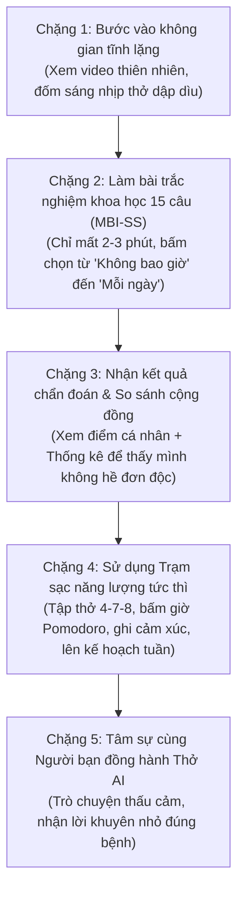

# ĐỀ ÁN CHĂM SÓC SỨC KHỎE TÂM LÝ HỌC ĐƯỜNG
# THỞ — CÙNG VƯỢT QUA BURNOUT HỌC ĐƯỜNG 🌤️

> **Tài liệu thuyết minh tính năng, luồng trải nghiệm, cơ chế lưu trữ và các nguyên tắc hoạt động thực tế**  
> *(Tài liệu nghiệp vụ thuần túy — Dành cho khách hàng, người thuyết trình, phụ huynh, giáo viên và ban giám khảo)*

---

## MỤC LỤC
1. [Tổng quan đề án & Triết lý "Vùng an toàn"](#1-tổng-quan-đề-án--triết-lý-vùng-an-toàn)
   - 1.1. Mục tiêu cốt lõi của website
   - 1.2. Triết lý đặc biệt: "Không cần tài khoản — Không cần đăng nhập" (No-Auth)
2. [Bản đồ hành trình trải nghiệm (Full User Flow)](#2-bản-đồ-hành-trình-trải-nghiệm-full-user-flow)
3. [Chi tiết từng tính năng — Ràng buộc, Nơi lưu trữ & Thời hạn Reset](#3-chi-tiết-từng-tính-năng--ràng-buộc-nơi-lưu-trữ--thời-hạn-reset)
   - 3.1. Bài trắc nghiệm đánh giá kiệt sức học tập (MBI-SS)
   - 3.2. Bảng thống kê cộng đồng thời gian thực (Live Stats)
   - 3.3. Bài tập điều hòa nhịp thở 4-7-8 (Harmonious Breathing)
   - 3.4. Đồng hồ tập trung Pomodoro (25 phút / 5 phút)
   - 3.5. Nhật ký theo dõi cảm xúc (Mood Tracker)
   - 3.6. Bảng kế hoạch tuần cân bằng (Weekly Planner)
4. [Chuyên sâu về Trợ lý Tâm lý "Thở AI"](#4-chuyên-sâu-về-trợ-lý-tâm-lý-thở-ai)
   - 4.1. Thở AI hoạt động dựa trên Logic gì?
   - 4.2. Bộ hàng rào bảo vệ an toàn (Quy tắc 4 KHÔNG)
   - 4.3. Các ràng buộc kỹ thuật & Lý do vì sao phải có?
   - 4.4. Lịch sử trò chuyện được lưu ở đâu & Bao lâu thì tự xóa?
   - 4.5. Thiết kế nút bấm Chatbot thông minh & Tinh tế
5. [Bảng tổng hợp đối chiếu toàn bộ tính năng (Tra cứu nhanh)](#5-bảng-tổng-hợp-đối-chiếu-toàn-bộ-tính-năng-tra-cứu-nhanh)
6. [Lời kết & Khuyến cáo Y khoa (Disclaimer)](#6-lời-kết--khuyến-cáo-y-khoa-disclaimer)

---

## 1. TỔNG QUAN ĐỀ ÁN & TRIẾT LÝ "VÙNG AN TOÀN"

### 1.1. Mục tiêu cốt lõi của website
Dự án **Thở (Tho Breathing)** là một không gian số tĩnh lặng hỗ trợ học sinh THPT nhận diện và chủ động vượt qua hội chứng kiệt sức học tập (Academic Burnout). Mục tiêu lớn nhất của dự án là: **Bất kỳ học sinh nào khi cảm thấy mệt mỏi, quá tải đều có thể mở trang web lên và được xoa dịu tức thì chỉ trong vòng 30 giây.**

---

### 1.2. Triết lý đặc biệt: "Không cần tài khoản — Không cần đăng nhập" (No-Auth)
Khác với hầu hết các ứng dụng hiện nay luôn bắt người dùng phải bấm "Đăng ký", nhập Email, Số điện thoại hoặc tạo Mật khẩu, Thở hoàn toàn **LOẠI BỎ 100% CÁC BƯỚC ĐĂNG KÝ VÀ ĐĂNG NHẬP**.

- **Lý do tâm lý học đường:**  
  Tâm lý học sinh tuổi dậy thì vô cùng nhạy cảm. Các em luôn có nỗi sợ vô hình rằng thầy cô, cha mẹ hay bạn bè cùng lớp sẽ biết mình đang bị căng thẳng, bất ổn hoặc xem mình là "khác biệt". Bất kỳ yêu cầu nào đòi hỏi thông tin cá nhân như số điện thoại hay tài khoản mạng xã hội đều sẽ tạo ra rào cản phòng thủ, khiến học sinh lập tức đóng trang web lại.
- **Không cần đăng nhập thì hệ thống nhận diện học sinh thế nào?**  
  Khi học sinh bắt đầu làm bài trắc nghiệm, hệ thống chỉ hỏi 2 thông tin tối giản: **Tên gọi hoặc Biệt danh** (ví dụ: "Minh", "Mây Mây") và **Năm sinh** (để biết tuổi xưng hô phù hợp). Trình duyệt trên điện thoại hoặc máy tính của học sinh sẽ tự động tạo một mã phiên ẩn riêng biệt. Nhờ đó, học sinh vẫn nhận được lời khuyên cá nhân hóa xưng hô thân mật, trong khi danh tính thật hoàn toàn được giữ kín 100%.

> [!NOTE]
> **Nguyên tắc "Vùng an toàn":** Không lưu địa chỉ nhà, không lưu trường lớp, không hỏi số điện thoại. Học sinh vào trang web ẩn danh hoàn toàn, an tâm trải lòng trung thực mà không sợ bị phán xét.

---

## 2. BẢN ĐỒ HÀNH TRÌNH TRẢI NGHIỆM (FULL USER FLOW)

Trải nghiệm trên website được bố trí khoa học từ trên xuống dưới theo đúng tiến trình tâm lý của một người đang mệt mỏi: *Được đón nhận nhẹ nhàng ➔ Tự nhận diện tình trạng ➔ Thấy mình không cô đơn ➔ Nhận công cụ xoa dịu ➔ Trò chuyện giãi bày nỗi lòng.*

---

## 3. CHI TIẾT TỪNG TÍNH NĂNG — RÀNG BUỘC, NƠI LƯU TRỮ & THỜI HẠN RESET

### 3.1. Tính năng Bài Trắc Nghiệm Đánh Giá Kiệt Sức Học Tập (MBI-SS)
- **Là gì và giải quyết điều gì:**  
  Bài kiểm tra 15 câu chuẩn tâm lý học quốc tế, chia thành 3 khía cạnh: (1) Kiệt sức thể xác & cảm xúc, (2) Thái độ thờ ơ/hoài nghi việc học, (3) Cảm giác tự ti về năng lực. Kết quả chia làm 3 mức: **Bình thường**, **Nguy cơ vừa**, **Kiệt sức cao**.
- **Lưu trữ ở đâu?**
  - **Trên Máy chủ Đám mây trung tâm:** Chỉ lưu ẩn danh Tên/Biệt danh, Năm sinh và Điểm số 3 khía cạnh để máy chủ tổng hợp số liệu cho biểu đồ cộng đồng.
  - **Trên Thiết bị của học sinh (Bộ nhớ trình duyệt web):** Lưu lại kết quả để mỗi khi học sinh mở web ra là thấy ngay điểm của mình mà không cần làm lại từ đầu; đồng thời chuyển điểm số này cho Chatbot Thở AI hiểu tình trạng của bạn.
- **Bao lâu thì hết hạn (Reset) & Lý do vì sao?**
  - **Thời hạn hiệu lực: Đúng 7 ngày.**
  - **Lý do khoa học:** Tâm lý học sinh biến động theo từng tuần học. Kết quả kiểm tra của tuần thi cử căng thẳng không thể đại diện cho tuần sau khi đã thi xong. Hết 7 ngày, hệ thống sẽ tự làm mới để nhắc học sinh đánh giá lại tâm trạng tuần mới.
  - **Quyền chủ động:** Trên màn hình luôn hiển thị rõ dòng chữ: *"Hiệu lực kết quả: Đến ngày... (còn X ngày)"*. Học sinh có thể bấm nút **"Làm lại khảo sát"** bất cứ lúc nào nếu muốn đánh giá lại ngay lập tức mà không cần đợi hết 7 ngày.

---

### 3.2. Tính năng Bảng Thống Kê Cộng Đồng Thời Gian Thực (Live Stats)
- **Là gì và giải quyết điều gì:**  
  Hiển thị tỷ lệ phần trăm học sinh trong trường/cộng đồng đang ở mức Bình thường, Nguy cơ vừa hay Kiệt sức cao. Giúp học sinh nhận ra mình không cô đơn, giảm bớt tâm lý mặc cảm tự ti.
- **Lưu trữ & Làm mới:**  
  Dữ liệu tự động cập nhật ngay lập tức từ máy chủ trung tâm mỗi khi có một bạn học sinh nộp bài khảo sát mới.

---

### 3.3. Tính năng Điều Hòa Nhịp Thở 4-7-8 (Harmonious Breathing)
- **Là gì và giải quyết điều gì:**  
  Vòng tròn đồ họa phập phồng dẫn nhịp theo phương pháp của Đại học Harvard: *Hít vào bằng mũi 4 giây ➔ Giữ hơi 7 giây ➔ Thở ra từ từ bằng miệng 8 giây*. Kích hoạt hệ thần kinh phó giao cảm, hạ nhịp tim và huyết áp, cắt đứt cơn hoảng loạn tức thì trước giờ thi.
- **Lưu trữ & Ràng buộc:**  
  Không lưu trữ bất kỳ dữ liệu nào, không giới hạn số lần tập. Nút bấm được căn giữa ngay dưới vòng tròn thở để học sinh thao tác bằng một tay dễ dàng trên điện thoại.

---

### 3.4. Tính năng Đồng Hồ Tập Trung Pomodoro (25 phút / 5 phút)
- **Là gì và giải quyết điều gì:**  
  Chia buổi học thành các đợt 25 phút tập trung sâu và 5 phút nghỉ ngơi ngắn. Giúp não bộ học sinh không bị cạn kiệt năng lượng, ngăn chặn hiện tượng kiệt sức tích tụ.
- **Lưu trữ & Ràng buộc:**  
  Chạy trực tiếp trên thiết bị, có chuông âm thanh êm dịu khi hết giờ và hiệu ứng pháo hoa khích lệ tinh thần khi hoàn thành phiên học.

---

### 3.5. Tính năng Nhật Ký Theo Dõi Cảm Xúc (Mood Tracker)
- **Là gì và giải quyết điều gì:**  
  Cho phép học sinh chọn 1 trong 5 biểu tượng cảm xúc (Rất tuyệt, Vui vẻ, Bình thường, Căng thẳng, Kiệt sức) và bấm lưu lại. Giúp học sinh học cách gọi tên và làm chủ cảm xúc của mình (*"Name it to tame it"*).
- **Lưu trữ ở đâu?**  
  Lưu hoàn toàn trên thiết bị của học sinh (Bộ nhớ trình duyệt web). Không ai khác có thể xem được.
- **Bao lâu thì làm mới?**  
  Mỗi ngày học sinh có thể vào chọn lại cảm xúc của ngày hôm đó để theo dõi xem tâm trạng của mình trong tuần đang đi lên hay đi xuống.

---

### 3.6. Tính năng Kế Hoạch Tuần Cân Bằng (Weekly Planner)
- **Là gì và giải quyết điều gì:**  
  Bảng phân bổ thói quen lành mạnh trong 7 ngày (từ Thứ Hai đến Chủ Nhật). Học sinh có thể tự gõ tên thói quen (như: *Ngủ trước 23h, Uống đủ nước, Tập thể dục 15p...*) và tích chọn mỗi ngày khi hoàn thành. Trên máy tính hiển thị bảng 7 cột, trên điện thoại hiển thị thẻ thông minh với 7 nút tròn (T2..CN), ngày hôm nay được làm nổi bật để chạm tích cực nhanh.
- **Lưu trữ ở đâu?**  
  Lưu hoàn toàn trên thiết bị cá nhân của học sinh (Bộ nhớ trình duyệt web).
- **Bao lâu thì làm mới (Reset) & Điểm đặc biệt thông minh:**
  - **TỰ ĐỘNG LÀM MỚI VÀO MỖI SÁNG THỨ HAI HÀNG TUẦN:** Khi bước sang tuần mới, hệ thống tự động xóa sạch các dấu tích của tuần cũ, **NHƯNG GIỮ NGUYÊN TẤT CẢ TÊN CÁC THÓI QUEN** mà học sinh đã gõ. Học sinh không mất công gõ lại từ đầu, sẵn sàng bước vào tuần mới với một trang giấy mới tinh khôi!
  - **Nút làm mới chủ động:** Có sẵn nút **"Làm mới tuần"** để học sinh bấm xóa tích bất cứ lúc nào nếu muốn bắt đầu lại giữa tuần.

---

## 4. CHUYÊN SÂU VỀ TRỢ LÝ TÂM LÝ "THỞ AI"

Chatbot Thở AI là tính năng nhận được nhiều sự quan tâm nhất của dự án. Đây không phải là một con bot giải toán hay trả lời tự động thông thường, mà được thiết kế như một **Chuyên viên tư vấn tâm lý học đường thấu cảm**, hoạt động dựa trên các nguyên lý hành vi đặc thù:

### 4.1. Thở AI hoạt động dựa trên Logic gì?
Điểm mấu chốt tạo nên sự khác biệt của Thở AI là: **AI ĐÃ HIỂU BẠN TRƯỚC KHI BẠN KỊP LÊN TIẾNG.**

1. **Đọc hiểu hồ sơ tâm lý tự động:**  
   Trước khi mở chat, học sinh đã hoàn thành bài trắc nghiệm 15 câu. Thở AI sẽ tự động đọc hồ sơ này để biết: Học sinh tên là gì, bao nhiêu tuổi, điểm Kiệt sức cảm xúc cao hay điểm Hoài nghi cao.
2. **Kê đơn lời khuyên "đúng bệnh":**
   - Nếu học sinh có điểm **Kiệt sức cảm xúc cao:** AI hiểu rằng bạn đang mệt rã rời về thể xác. AI sẽ khuyên bạn gập sách lại, hướng dẫn thở 4-7-8, uống nước ấm và giục đi ngủ trước 23h.
   - Nếu học sinh có điểm **Hoài nghi việc học cao:** AI hiểu rằng bạn đang chán nản, thấy việc học vô nghĩa. AI sẽ không ép bạn học, mà gợi mở về ước mơ ban đầu, khơi gợi lại niềm vui nho nhỏ trong môn học bạn từng yêu thích.
   - Nếu học sinh có điểm **Tự ti năng lực cao:** AI sẽ chia nhỏ bài học thành từng mẩu ngắn 10-15 phút để bạn giải quyết từng phần, lấy lại sự tự tin từng bước một.
3. **Phương pháp "Hành động siêu nhỏ" (Micro-steps):**  
   Tuyệt đối không nói những câu sáo rỗng vô thưởng vô phạt như *"Cố gắng lên"* hay *"Đừng buồn nữa"*. Thay vào đó, AI hướng dẫn các việc có thể làm ngay trong 1 phút (ví dụ: đứng dậy vươn vai, rửa mặt bằng nước mát, nghe một bài nhạc êm).

---

### 4.2. Bộ Hàng Rào Bảo Vệ An Toàn (Quy tắc 4 KHÔNG)

1. **KHÔNG chẩn đoán bệnh tâm thần:**  
   Thở AI khẳng định mình là người bạn lắng nghe, không phải bác sĩ. Khi phát hiện học sinh có dấu hiệu rối loạn tâm lý nghiêm trọng hoặc suy nghĩ tiêu cực nguy hiểm (tự hại), AI sẽ lập tức từ chối khuyên bừa và hiển thị ngay số **Tổng đài Quốc gia Bảo vệ Trẻ em (111)** hoặc **Tổng đài Tư vấn Tâm lý (1900 6233)** kèm lời khuyên chia sẻ với cha mẹ.
2. **KHÔNG giải bài tập hộ:**  
   Nếu học sinh dán đề toán, đề văn vào nhờ làm hộ, Thở AI sẽ từ chối khéo léo, nhắc nhở rằng AI ở đây để giúp bạn bình tâm và tìm lại phương pháp học, chứ không làm bài thay bạn.
3. **KHÔNG trả lời chuyện ngoài lề:**  
   Từ chối mọi câu hỏi lệch lạc về chính trị, cờ bạc, bói toán hay nội dung độc hại.
4. **KHÔNG nói dài dòng gây ngợp:**  
   Câu trả lời luôn ngắn gọn, ngắt dòng thoáng đãng, chia thành các gạch đầu dòng rõ ràng để người đang mệt mỏi đọc cảm thấy dễ chịu nhất.

---

### 4.3. Các Ràng Buộc Kỹ Thuật (Constraints) & Lý Do Thực Tế Vì Sao Phải Có

| Ràng buộc (Constraint) | Quy định cụ thể | Lý do vì sao phải có? (Giải thích bình dân) |
|---|---|---|
| **Giới hạn tin nhắn theo ngày** | Tối đa **30 câu / ngày / bạn** | 1. **Lý do tâm lý:** Tránh để học sinh "nghiện chat" thâu đêm với máy móc thay vì đi ngủ thật sự. 2. **Lý do công bằng:** Tránh việc một vài bạn dùng quá nhiều làm cạn kiệt tài nguyên hệ thống. *(Có đồng hồ đếm ngược công khai trên đầu khung chat: "Hôm nay: còn X/30 tin")*. |
| **Giới hạn chống spam** | Tối đa **5 câu / phút** | Ngăn chặn kẻ xấu hoặc phần mềm tự động bắn tin liên tục làm máy chủ bị đơ hay quá tải. |
| **Độ dài tin nhắn của bạn** | Tối đa **500 chữ / câu** | Khuyến khích học sinh đúc kết cảm xúc ngắn gọn, tránh việc dán nguyên một bài văn dài làm tràn bộ nhớ AI. |
| **Độ dài câu trả lời của AI** | Tối đa **khoảng 300 từ** | Giữ câu trả lời súc tích, ngắt dòng thoáng, dễ đọc trên màn hình điện thoại mà không thấy "ngợp chữ". |
| **Hiệu ứng chữ chạy mượt mà** | Phát từng chữ tức thì | Thay vì để học sinh phải chờ quay vòng 5-8 giây rồi đùng một cái hiện cả đoạn văn dài, chữ sẽ hiện ra từng từ như có một người bạn đang ngồi gõ phím trực tiếp. |

---

### 4.4. Lịch Sử Trò Chuyện Được Lưu Ở Đâu & Bao Lâu Thì Tự Xóa?
- **Lưu trữ ở đâu?**  
  Lịch sử đoạn chat được lưu trên Máy chủ Đám mây bảo mật được mã hóa. Điều này giúp học sinh dù vô tình tải lại trang web hoặc đóng trình duyệt thì khi mở lại vẫn thấy cuộc trò chuyện dang dở của mình mà không bị mất.
- **TỰ ĐỘNG XÓA SỔ VĨNH VIỄN SAU 30 NGÀY:**
  - **Cơ chế:** Sau 30 ngày kể từ tin nhắn cuối cùng, hệ thống máy chủ sẽ tự động xóa sạch toàn bộ lịch sử trò chuyện. Dữ liệu một khi đã bị xóa sẽ biến mất vĩnh viễn, không thể phục hồi.
  - **Lý do bảo mật:** Những lời tâm sự, nỗi lòng của học sinh là thông tin riêng tư tuyệt đối. Việc tự động xóa sau 30 ngày đảm bảo không ai (kể cả quản trị viên hệ thống) có thể xem lại nhật ký trò chuyện của các em.
  - **Nút tự tay xóa ngay:** Trong khung chat có sẵn biểu tượng thùng rác. Học sinh có thể tự tay bấm xóa sạch toàn bộ cuộc trò chuyện bất cứ lúc nào.

---

### 4.5. Thiết Kế Nút Bấm Chatbot Thông Minh & Tinh Tế
- **Cố định mép phải màn hình:**  
  Nút Thở AI tròn nổi luôn được neo chắc chắn ở mép phải màn hình, vị trí mặc định ở góc dưới bên phải (thuận tiện nhất cho ngón tay cái khi cầm điện thoại và con chuột khi dùng máy tính).
- **Cho phép kéo trượt dọc:**  
  Nếu nút bấm vô tình che mất chữ hay hình ảnh trên trang web, học sinh có thể dùng ngón tay kéo trượt nó lên trên hoặc xuống dưới dọc theo mép phải. Nút được giới hạn an toàn: không bao giờ che thanh menu ở trên và không bao giờ trôi mất khỏi màn hình ở dưới.
- **Không bao giờ bị nhảy lệch:**  
  Dù học sinh có xoay ngang điện thoại hay đổi kích thước cửa sổ máy tính, nút bấm luôn bám chặt vào mép phải, không bao giờ bị nhảy ra giữa màn hình hay kẹt sang mép trái.
- **Bỏ chữ "Beta":**  
  Tiêu đề khung chat chỉ hiển thị trang trọng *"Thở AI"* cùng thông điệp *"Đồng hành tâm lý học đường"*, tạo sự tin cậy và an tâm.

---

## 5. BẢNG TỔNG HỢP ĐỐI CHIẾU TOÀN BỘ TÍNH NĂNG (TRA CỨU NHANH)

| Tên Tính Năng | Cần Đăng Nhập? | Lưu Ở Đâu? | Thời Hạn Reset / Xóa | Lý Do Thiết Kế |
|---|---|---|---|---|
| **Bài test Burnout 15 câu (MBI-SS)** | **KHÔNG** (Chỉ cần Tên & Năm sinh) | Máy chủ trung tâm & Bộ nhớ máy học sinh | **Hết hạn sau 7 ngày** (hoặc bấm làm lại ngay) | Tâm lý học sinh thay đổi theo từng tuần học; cần đánh giá lại cho tuần mới. |
| **Bảng Thống kê Cộng đồng** | **KHÔNG** | Máy chủ trung tâm | Cập nhật liên tục theo thời gian thực | Học sinh nhìn vào thấy được mình không hề đơn độc. |
| **Bài tập thở 4-7-8** | **KHÔNG** | Không lưu trữ | Không giới hạn | Kích hoạt hệ thần kinh phó giao cảm, hạ nhịp tim lập tức. |
| **Đồng hồ Pomodoro** | **KHÔNG** | Chạy trên máy học sinh | Tự làm mới sau mỗi chu kỳ 25p / 5p | Chống quá tải não bộ, hồi phục dopamine. |
| **Nhật ký Cảm xúc (Mood Tracker)** | **KHÔNG** | Bộ nhớ máy học sinh | Chọn lại mỗi ngày mới | Giúp học sinh tự gọi tên và làm chủ cảm xúc. |
| **Kế hoạch Tuần (Weekly Planner)** | **KHÔNG** | Bộ nhớ máy học sinh | **TỰ ĐỘNG RESET SÁNG THỨ HAI** (Giữ tên thói quen) | Tạo trang giấy mới đầu tuần mà không bắt học sinh phải gõ lại tên thói quen. |
| **Trợ lý Tâm lý Thở AI** | **KHÔNG** | Máy chủ bảo mật mã hóa | **TỰ ĐỘNG XÓA SAU 30 NGÀY** (hoặc bấm thùng rác) | Bảo mật tuyệt đối nhật ký tâm sự; giới hạn 30 câu/ngày để nhắc đi ngủ sớm. |

---

## 6. LỜI KẾT & KHUYẾN CÁO Y KHOA (DISCLAIMER)

Website **Thở — Cùng vượt qua Burnout học đường** được tạo ra bằng tất cả sự thấu hiểu và trân trọng đối với những áp lực mà các bạn học sinh THPT đang gánh vác. Mỗi tính năng, từng nút bấm, từng khoảng thời gian giới hạn đều được tính toán kỹ lưỡng vì lợi ích sức khỏe lâu dài của học sinh.

> [!WARNING]
> **KHUYẾN CÁO QUAN TRỌNG DÀNH CHO NGƯỜI DÙNG:**  
> Các công cụ trên website và trợ lý Thở AI chỉ mang tính chất nâng đỡ tinh thần, giáo dục kỹ năng sống và phòng ngừa sớm. Website **KHÔNG thay thế** cho việc chẩn đoán hay điều trị y khoa của bác sĩ chuyên khoa tâm thần. Khi cảm thấy quá sức chịu đựng, học sinh hãy mạnh dạn chia sẻ với người lớn hoặc gọi **Tổng đài Quốc gia Bảo vệ Trẻ em 111** để được hỗ trợ kịp thời.

---

**NHÓM PHÁT TRIỂN ĐỀ ÁN THỞ**  
*«Hít một hơi thật sâu, thở ra thật chậm. Bạn đang làm rất tốt rồi!»* 🌤️
